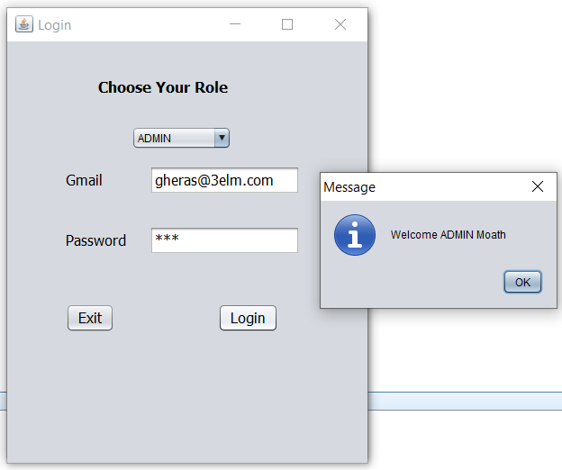
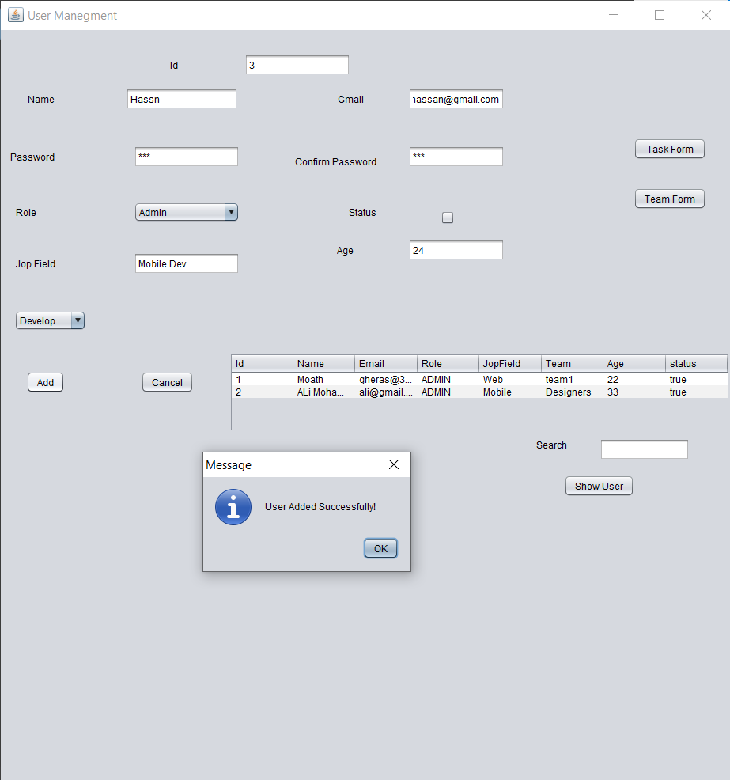
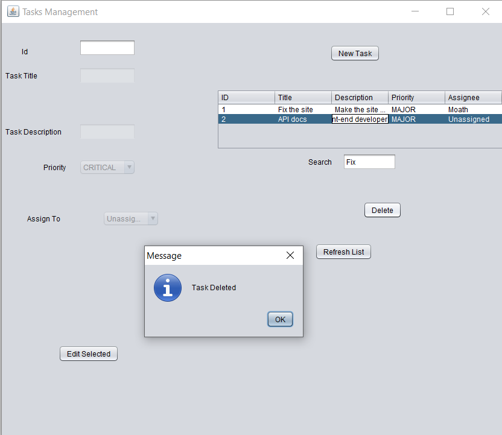
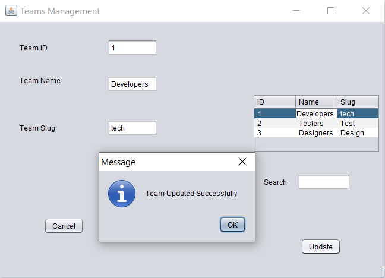

# Simple Task Manager System

A robust and intuitive desktop application built with **Java** and **Swing** for managing tasks, teams, projects, and users. 

This project aims to provide a streamlined, user-friendly interface to track project progress, manage team members, and assign tasks effectively. It's designed with clean architecture principles, separating the User Interface from the core business logic.

## 🚀 Features

* **User Management:** Add, update, delete, and view users. Supports different user roles (e.g., Admin) and tracks user status.
* **Team Management:** Create and manage teams, making it easier to assign tasks to specific groups of people.
* **Task Tracking:** Comprehensive task management including creating tasks, assigning them to users/teams, and tracking their status.
* **Project Organization:** Group related tasks into projects for better high-level management.
* **Interactive UI:** Clean, responsive, and dynamic graphical user interface built with Java Swing. Includes features like real-time form validation and dynamic component toggling (Edit/Save states).
* **In-Memory Data Store:** Uses an in-memory data structure (`DataStore.java`) populated with dummy data for quick testing and demonstration without the need to configure a database.

## 📂 Project Structure

The project follows a modular structure for better maintainability:

* `src/FormsPackage/`: Contains all the GUI (Graphical User Interface) components and forms (`.java` and `.form` files generated by NetBeans).
  * `Users.java`
  * `Tasks.java`
  * `Teams.java`
  * `Project.java`
  * `Login.java`
* `src/ClassesPackage/`: Contains the core models, business logic, and the mock database.
  * `UserClass.java`, `TeamClass.java`, `TaskClass.java`, `ParentClass.java`
  * `UserRole.java` (Enum)
  * `DataStore.java` (In-memory storage for application data)

## 🛠️ Technologies Used

* **Language:** Java
* **UI Framework:** Java Swing / AWT
* **IDE:** Apache NetBeans (Recommended for modifying `.form` files)

## ⚙️ How to Run

1. **Prerequisites:** Ensure you have the [Java Development Kit (JDK)](https://www.oracle.com/java/technologies/downloads/) installed on your system.
2. **Clone the repository:**
   ```bash
   git clone https://github.com/ProMoath/Simple-Task-Manager-System.git
   ```
3. **Open in IDE:**
   * Open **Apache NetBeans** (or your preferred IDE that supports Java Swing).
   * Select `File` -> `Open Project` and navigate to the cloned folder.
4. **Run the Application:**
   * Locate the `Login.java` or your main entry point in the `FormsPackage`.
   * Right-click the file and select **Run File** (or press `Shift + F6` in NetBeans).

*(Note: Since the app uses an in-memory `DataStore`, any changes made during runtime will reset when the application is closed.)*

## 📸 Screenshots

| Login Screen | Users Dashboard |
|:---:|:---:|
|  |  |

| Tasks Management | Teams Management |
|:---:|:---:|
|  |  |

## 🤝 Contributing

This project is a great starting point for learning Java Swing and application architecture. Feel free to [fork](https://github.com/ProMoath/Simple-Task-Manager-System/fork) the project, submit [pull requests](https://github.com/ProMoath/Simple-Task-Manager-System/pulls), check the [issues page](https://github.com/ProMoath/Simple-Task-Manager-System/issues).
 or use it for educational purposes.

 ---

 <div align="center">
  <p>⭐ If you liked this project, please give it a star!</p>
</div>